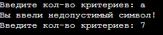
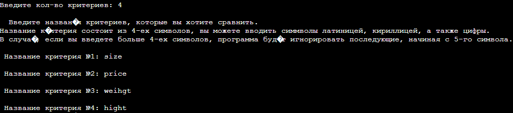
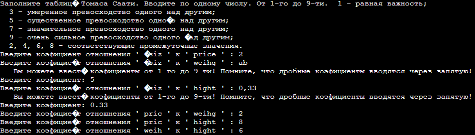
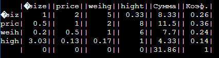
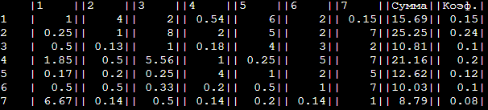

# Lab6
## Метод анализа иерархий Томаса Саати для одного уровня.
_____
### Описание программы
Входные данные: количество критериев, данные попарного сравнения критериев.
Выходные данные: весовые коэффициенты в виде 0.00.
_____
### Скриншоты входных  данных
#### Тестовые данные 1

Предупреждает об ошибке при вводе критерия
#### Тестовые данные 2

Ввод названий критериев
#### Тестовые данные 3

Ввод коэффициентов критериев, предупреждает при ошибке ввода
### Скриншоты выходных  данных

_____
### Среда разработки
Программа написана на языке С++. Программу можно запустить через онлайн-компилятор [OnlineJBD](https://onlinegdb.com/YqdW4sI2S)
